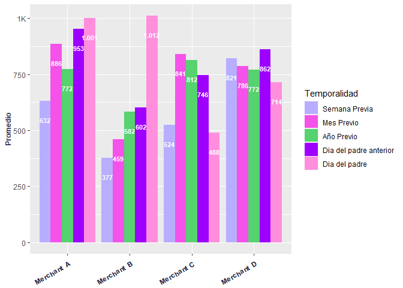
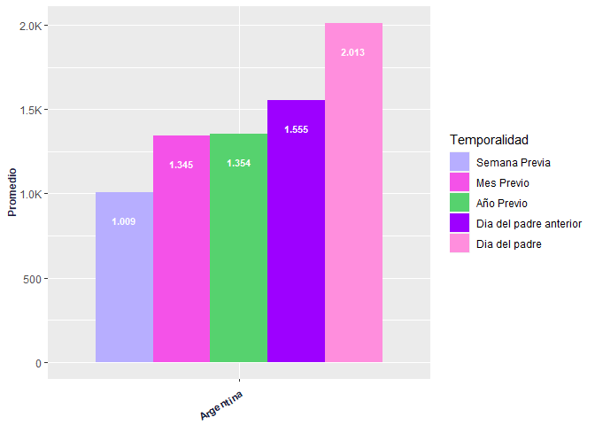
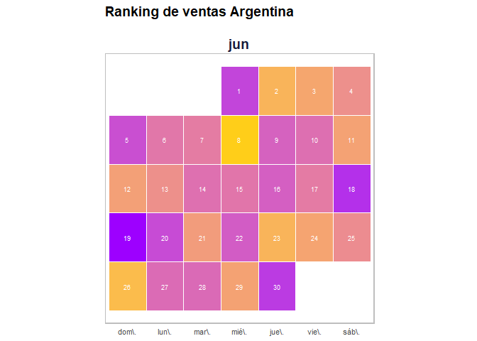

<!-- README.md is generated from README.Rmd. Please edit that file -->

    #> i Loading specialdates


# specialdates

<!-- badges: start -->
<!-- badges: end -->

El objetivo de este paquete es ofrecer algunas funciones para
**comparar** las ventas o transacciones de un negocio durante **fechas
especiales o comerciales,** como el dia del padre o el Hot Sale.

## Installation

Puede instalar la version de desarrollo desde:

``` r
# install.packages("devtools")
devtools::install_github("hghernandez/specialdates")
```

## Comparaciones de dias

Aquí se muestran ejemplos del uso de la función para comparar fechas
utilizando distintos niveles de agrupamiento.

### Agrupado a nivel de paises

``` r
library(specialdates)

data(ventas)

country <- comparables.days.means(df = ventas,
                                         fields.date = "fechas",
                                         valor = "cantidad",
                                         fecha = c('2022-06-17','2022-06-19'),
                                         agrupador = "country",
                                         festividad = "Dia del padre",
                                         mov.days= c('2021-06-18','2021-06-20'),
                                         graf.label = TRUE)

country$cuadro
#> # A tibble: 2 x 10
#>   country       n    pw   `%`    pm   `%`    py   `%`  pmov   `%`
#>   <chr>     <dbl> <dbl> <dbl> <dbl> <dbl> <dbl> <dbl> <dbl> <dbl>
#> 1 Argentina 2013.  1009  99.5 1345   49.6 1354.  48.6  1555  29.4
#> 2 Uruguay   1203.  1345 -10.6 1627. -26.1 1584  -24.1  1608 -25.2

country$grafico
```


### Agrupado a nivel de merchant

``` r
merchant <- comparables.days.means(df = ventas,
                                                fields.date = "fechas",
                                                valor = "cantidad",
                                                fecha = c('2022-06-17','2022-06-19'),
                                                agrupador = "merchant",
                                                festividad = "Dia del padre",
                                                mov.days = c('2021-06-18','2021-06-20'),
                                                graf.label = TRUE)

merchant$cuadro
#> # A tibble: 4 x 10
#>   merchant       n    pw    `%`    pm    `%`    py    `%`  pmov   `%`
#>   <chr>      <dbl> <dbl>  <dbl> <dbl>  <dbl> <dbl>  <dbl> <dbl> <dbl>
#> 1 Merchant A 1001.  632.  58.4   886   12.9   772.  29.6   953    5  
#> 2 Merchant B 1012   377. 168.    459  120.    582   73.9   602   68.1
#> 3 Merchant C  488.  524   -6.81  841  -41.9   812. -39.9   746. -34.5
#> 4 Merchant D  714.  821  -13.0   786.  -9.08  772.  -7.43  862. -17.2

merchant$grafico
```



\###Aplicamos un filtro al agrupador

``` r

country_filter <- comparables.days.means(df = ventas,
                                  fields.date = "fechas",
                                  valor = "cantidad",
                                  fecha = c('2022-06-17','2022-06-19'),
                                  agrupador = "country",
                                  filtro = "Argentina",
                                  festividad = "Dia del padre",
                                  mov.days= c('2021-06-18','2021-06-20'),
                                  graf.label = TRUE)

country_filter$cuadro
#> # A tibble: 1 x 10
#>   country       n    pw   `%`    pm   `%`    py   `%`  pmov   `%`
#>   <chr>     <dbl> <dbl> <dbl> <dbl> <dbl> <dbl> <dbl> <dbl> <dbl>
#> 1 Argentina 2013.  1009  99.5  1345  49.6 1354.  48.6  1555  29.4

country_filter$grafico
```



## Heatmap calendar

En los proximos ejemplos crearemos un heatmap sobre un calendario para
visualizar el comportamiento de los negocios o de los países. La función
**heatmap.calendar** crea el mapa de calor, para distintos niveles de
agrupamiento de a un valor a la vez. Por ello, es importante filtrar los
distintos valores de agrupamiento y generar los correspondientes
calendarios.

### Heatmap calendar a nivel de paises

``` r
heatmap.calendar(df = ventas,
fini = '2022-06-01',
ffin = '2022-06-30',
fields.date = 'fechas',
agrupador = 'country',
filtro = 'Argentina',
valor = 'cantidad',
titulo = 'Ranking de ventas',
exportar = FALSE)
```



``` r

heatmap.calendar(
  df = ventas,
  fini = '2022-06-01',
  ffin = '2022-06-30',
  fields.date = 'fechas',
  agrupador = 'country',
  filtro = 'Uruguay',
  valor = 'cantidad',
  titulo = 'Ranking de ventas',
  exportar = FALSE
)
```


